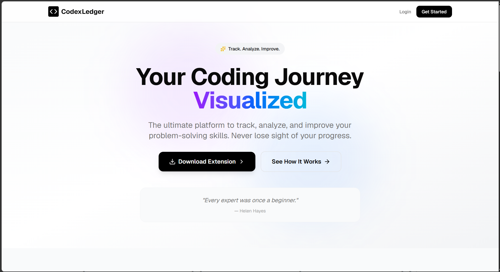
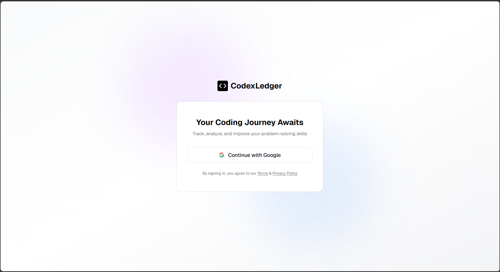
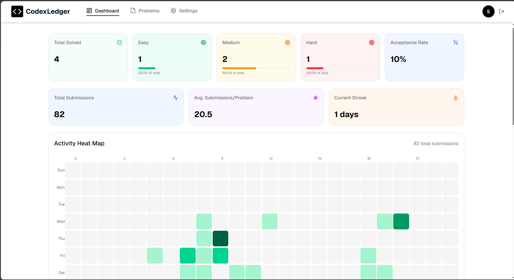
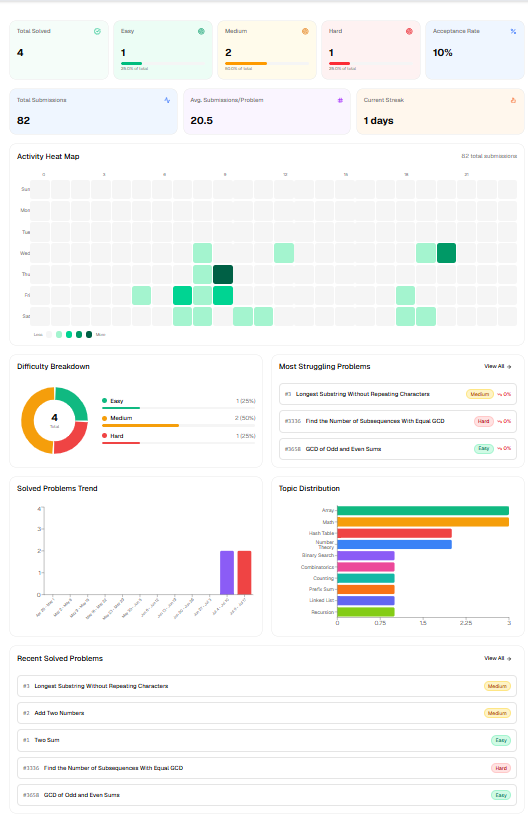
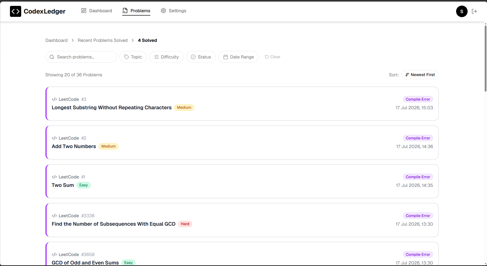
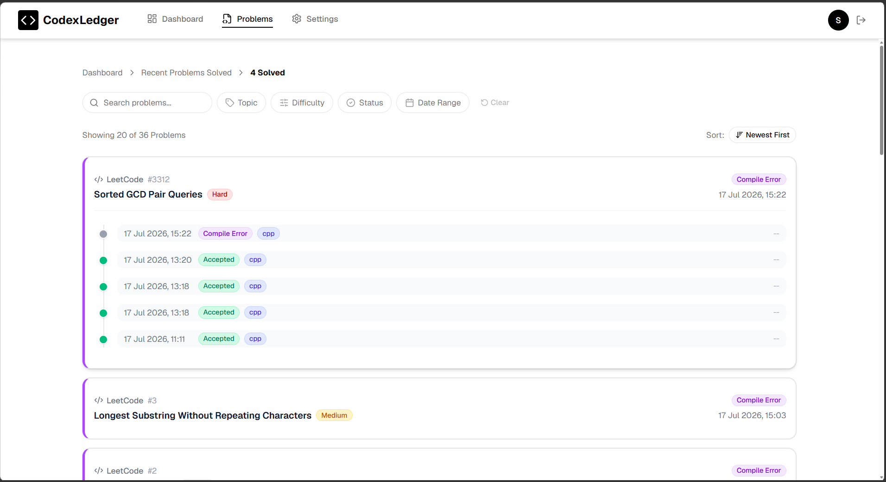
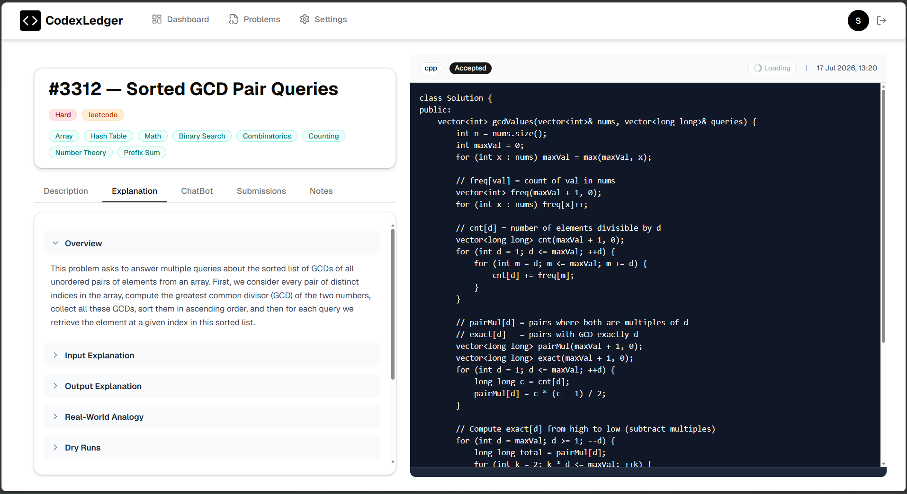
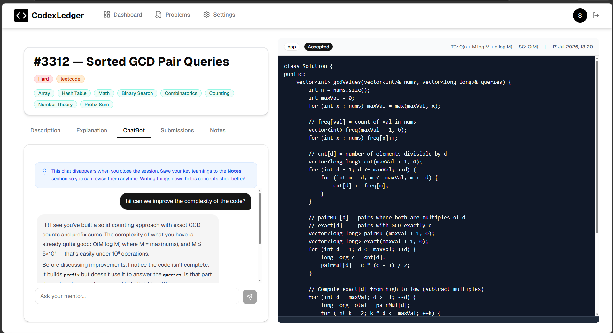
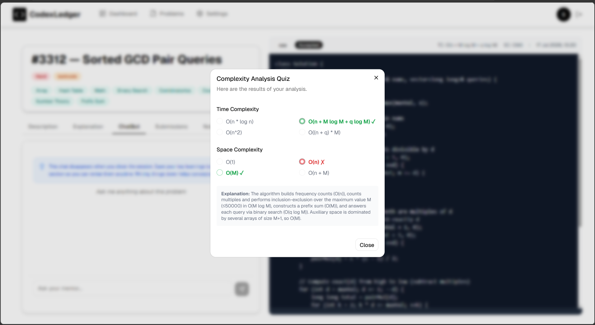
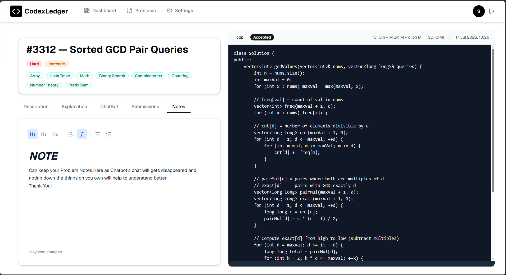

<div align="center">

# CodexLedger

### AI-Powered Learning Companion for LeetCode Interview Prep

**Track. Analyze. Improve.**

An intelligent coding journal that automatically captures your LeetCode activity, explains problems before you code, discusses your solutions without giving them away, and builds a personal knowledge base you can actually revise from.

<br>


</div>

---

# Why CodexLedger?

Long solution videos are mostly a thing of the past — these days it's faster to paste a problem into ChatGPT or another LLM and ask it to explain. It works, but it's repetitive and disposable: the same problem and code get pasted in over and over, nothing is kept, and there's no record of what you actually learned. Worse, going straight to an LLM for the answer quietly builds a dependency — the exact habit interview prep is supposed to break.

CodexLedger keeps what works about that workflow and fixes what doesn't. The extension captures the problem and every submission automatically, so there's nothing to copy-paste and every attempt is on record. Its AI features are built around discussion, not delivery — they explain, question, and quiz instead of solving, so you stay the one doing the thinking, and every problem adds to a knowledge base instead of disappearing with the chat.

> Don't just solve problems. Learn from every problem.

---

# Features

**Automatic Tracking** — A Chrome extension watches leetcode.com and sends the problem, your code, verdict, language, and topics to CodexLedger the moment you submit. Nothing to copy-paste, nothing to log by hand. *(Extension source isn't published in this repo yet.)*

**Problem Explorer** — Search by title and filter by topic, difficulty, status, or date range, with newest/oldest sorting.

**Submission Timeline & History** — Expand any problem in the explorer for a chronological timeline of every attempt, or open a problem to see its full submission history with verdict, language, and timestamp.

**Analytics Dashboard** — Solved count, easy/medium/hard split, acceptance rate, total submissions, average submissions per problem, and current streak, plus an activity heat map, difficulty breakdown, solved-problems trend, topic distribution, and a most-struggling-problems list.

**Rich Notes** — A per-problem rich text editor for writing down what actually clicked. Notes save locally first and sync in the background, with an unsynced-changes indicator so nothing is lost if you close the tab mid-thought.

---

# AI Features

**AI Problem Tutor** — Breaks the problem down before you write a line of code: an overview, what the input/output actually mean, edge cases, a real-world analogy, and worked dry runs.

**AI Problem Mentor** — A live chat scoped to the problem and your code. It reviews your logic, asks Socratic questions, and helps you debug — and it's built to decline direct "give me the solution" requests, nudging you toward the answer instead of handing it over. The chat doesn't persist, so key takeaways are worth saving to Notes.

**Complexity Analysis Quiz** — After every submission be it accepted or not, you're quizzed on the time and space complexity yourself before the correct answer and a full explanation are revealed.

---

# Screenshots

## Landing Page


## Sign In
Google sign-in via Firebase Authentication.



## Dashboard
Solved counts, streaks, and an activity heat map at a glance.



The same page, continued — difficulty breakdown, solved trend, topic distribution, and struggling problems.



## Problem Explorer
Search, filter, and sort across every problem you've touched.



## Submission Timeline
Expand a problem to see every attempt on a timeline without leaving the list.



## AI Problem Tutor
Understand the problem before you start coding.



## AI Problem Mentor
Guided discussion, not direct answers.



## Complexity Analysis Quiz
Test yourself before the answer is revealed.



## Submission History
Every attempt on a problem, with verdict, language, and timestamp.


## Rich Notes
A personal knowledge base, one problem at a time.



---

# Architecture

```
Chrome Extension  ──POST /api/sync──▶  Express API (TypeScript)
                                              │
                     ┌────────────┬───────────┼───────────┐
                     ▼            ▼           ▼           ▼
               PostgreSQL   Redis+BullMQ  Gemini+OpenAI  Firebase Auth
               (Prisma)     (job queue)   (AI features)  (Google sign-in)

Express API  ──REST + Socket.IO──▶  React Dashboard (Vite + TypeScript)
```

---

# Project Structure

```
CodexLedger
├── backend      Express API — Prisma/PostgreSQL, Redis/BullMQ, AI services, Socket.IO
├── frontend     React + Vite dashboard
└── assets       screenshots used in this README
```

---

# Getting Started

### Clone

```bash
git clone https://github.com/sayam242/CodexLedger.git
cd CodexLedger
```

### Backend

```bash
cd backend
npm install
```

Create `backend/.env`:

```
DATABASE_URL=
JWT_SECRET=
PORT=5000
FRONTEND_URL=http://localhost:5173
EXTENSION_SOURCE_URL=https://leetcode.com
EXTENSION_ID=
REDIS_URL=
GEMINI_API_KEY=
GEMINI_MODEL=
OPENAI_API_KEY=
OPENCODE_API_KEY=
```

```bash
npx prisma migrate dev
npm run dev
```

Requires a running PostgreSQL database and a Redis instance.

### Frontend

```bash
cd frontend
npm install
```

Create `frontend/.env` (see `frontend/.env.example`):

```
VITE_API_URL=
VITE_EXTENSION_ID=
VITE_FIREBASE_API_KEY=
VITE_FIREBASE_AUTH_DOMAIN=
VITE_FIREBASE_PROJECT_ID=
VITE_FIREBASE_STORAGE_BUCKET=
VITE_FIREBASE_MESSAGING_SENDER_ID=
VITE_FIREBASE_APP_ID=
```

```bash
npm run dev
```

---

# Roadmap

- [x] Automatic tracking via Chrome extension
- [x] Dashboard analytics
- [x] Submission timeline & history
- [x] Rich notes
- [x] Problem explorer (search & filters)
- [x] AI Problem Tutor
- [x] AI Problem Mentor
- [x] Complexity analysis quiz
- [ ] Flashcards & spaced repetition
- [ ] Contest analytics
- [ ] Multi-platform support
- [ ] Mobile app

---

# Contributing

Issues and PRs are welcome.

---

# Author

**Sayam**
B.Tech Electronics & Communication Engineering, Punjab Engineering College, Chandigarh
[github.com/sayam242](https://github.com/sayam242)

If this helped you, a ⭐ goes a long way.
